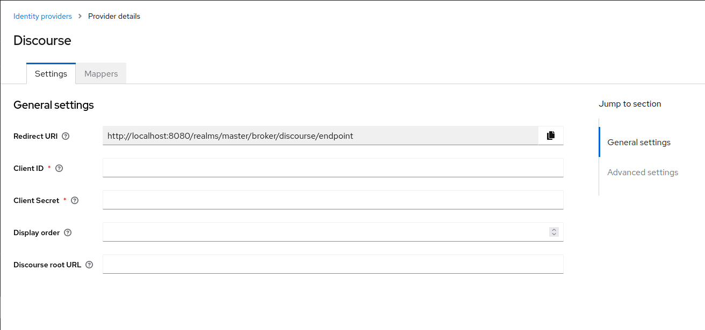

# Keycloak-Discourse

This repository contains an identity provider implementation for Keycloak.
Provider itself bridge information from Discourse powered forums.
Discourse as a tool is able to authenticate using popular OAuth or OpenID Connect providers.
However, it does not offer a OpenID Connect authorization endpoint for third parties.

## Compatibility

Authorization protocol between Discourse and Keycloak is so-called "Discourse Connect".

This v1 of extension was compatible with Keycloak 17.x-20.x, when using old admin console.
The v2 version of this identity provider aims compatibility with Keycloak in versions above 22.
The Keycloak 21 is unsupported due to missing old console and sufficient configuration mechanisms.

## Implementation details

Identity provider will copy common fields returned by Discourse which are:

- email
- username
- external_id (user id in discourse database)
- moderator
- admin

Keycloak uses internally email to match with its own users.
Currently, Discourse does not provide information such first/last name.
It has to be added upon successful authentication.

### License

This code is licensed under GNU Affero General Public License 3.0.
For exact license terms please see attached [LICENSE.txt](LICENSE.txt).

